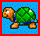

# Detailed user Manual

## Starting the game / server  

When palying in locale area networks, just start the fpc_atomic client on each machine. 

## How to start a "game"
The first player "host" a game, all the other players join the game.  
The "hosting" player waits until all player have connected the game, then press "return" to switch to player setup. Depending on teamplay settings (configurable in the options) each player selects its player color. When finished the "host" player press "return" and configures the map setup as needed. After this a further "return" starts the round. The round could end on 2 reasons.
- all except one player died
- in time mode, the available time is 0  
  
This repeats until the first player / team meets the number of wins to win the match.

## In game commands
"+" = Increase sound Volume during play  
"-" = Decrease sound volume during play  
"m" = Disable enable music during play

## Powerups and game control
 give a extra bomb  
 ability to trigger bombs, if picked up only a limited amount of bombs (see first action)  
 ability to spoog all available bombs (disables ability to grab bombs, see first action)  
 increase flame length by one  
 increase flame length to infinity  
 increase walk speed by 10% (max 160% of default speed)  
 ability to kick bombs (player needs to walk against a bomb to kick it)  
 all kicked bombs will now bounce on walls  
 add ability to grab bombs (disables ability to spooge bombs, see first action)  
 ability to punch bombs (see second action)  
 random powerup could be good or bad, who knows  
  decrease walk speed to 80%  
 get a random disease  
 get a random super bad disease  

### First action
- place bomb
  
### First action (double pressed)
- grab and throw bomb (if available)
- spoog all available boms (if available)
  
### Second action
- trigger all own bombs that are triggerable (and not flying)
- when pressed while walking against a bomb "punch" a bomb in walk direction (if available)

## Connect a Client over the internet
start the client with params:  
 -ip \<ip from router of server\>  
 -port \<port that is forwarded to the server port\>

if ip and port are defined, the game will always try to join on this as long as you restart the game or host, then the settings will be cleared.

## Server Control commands
Params:  
-p \<port\> = Port to listen on  
-t \<time\> = Timeout in seconds to automatically close if no user is connected (0= disabled)  
-l \<level\>= Loglevel (default = 2)  

### Commands (typed in via keyboard in the console window):  
u = unload actual ai  
a = load new ai