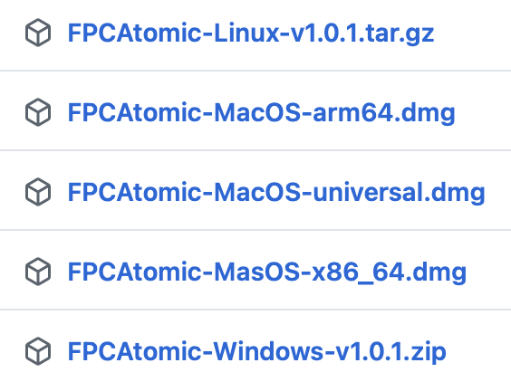

# FPC Atomic

Author       : Uwe Schächterle (Corpsman)  
Homepage     : https://www.Corpsman.de  
Source       : https://github.com/PascalCorpsman/fpc_atomic  
Wiki         : https://en.wikipedia.org/wiki/Atomic_Bomberman

MacOS version : Pavel Zvěřina

## Description
FPC Atomic is a complete reimplementation of the original Atomic Bomberman game (from 1997). This repository hosts only the source code, as the graphics and sounds are copyrighted by Interplay Productions. To play the game, you need to extract the original graphics from the game disc and provide them as requested by the game.

## Differences from the original fork

This version is a fork of the original FPC Atomic implementation by Uwe Schächterle (Corpsman). While maintaining compatibility with the original game mechanics, this fork focuses on:
- Native build macOS (Apple Silicon and Intel)
- Cross-platform game compatibility and native builds for all major platforms
- Build and deploy game server on [fly.io](https://fly.io)
- Modern deployment options (automated builds)
- Enhanced user experience (better controller support, network optimizations)
- Support of Game Controllers ()
- Support for up to 4 players on a single computer (2 Keyboards, 2 Game Controllers)
- Bug fixes and animation corrections

## Preview:

## What needs to be done to play the game?

1. get the Atomic Bomberman CD-content (buy the game it is worth it!) and store it on your harddrive  
   1.1 if you want all animations download and merge the expansion pack <del>from [here](https://www.oocities.org/timessquare/tower/4056/ani.html) or use this [direct download link](https://www.oocities.org/timessquare/tower/4056/download/ani.zip)</del> link is broken use [new link](https://www.geocities.ws/mheid.geo/download/ani.zip)  
   1.2 extract the content of ani.zip into the CD-Content "/DATA/ANI" subfolder

2. download the atomic_launcher from the latest release [here](https://github.com/PascalCorpsman/fpc_atomic/releases/latest) and store it on your harddisc 
 
   2.1 Linux users will need to 
   >
   > chmod +x atomic_launcher
   >
3. run the "atomic_launcher", click "check for updates" and then "Download and update files" 
   3.1 Linux users may need to run the following commands:
   >
   > sudo aptitude install libssl-dev
   >
4. click "run cd data extractor" 
   4.1 Click "set atomic cd root folder" 
   4.2 Click "start extraction"  
5. read the [manual](MANUAL.md) 
   5.5 if you are a Linux user run the "Linux_sound_install_script.sh"
6. start the game by executing "atomic_launcher" and enjoy

## How do i get updates ?
By using the launcher you can click the "check for update" feature to check wether there are updates available. If so, the launcher automatically asks you to download the updates.

## Differences to the original

- Implementation in TCP (instead of slow IPX)
- Custom AI implementation
- Single player mode is not present
- Not all sounds are used
- Joypad support via SDL2
- Missing online manual; use the [manual](MANUAL.md) provided in this repository instead (best UX if you have a .md viewer and can use the MANUAL.md that is shipped with the game after the CD-Content extraction).
- Pro gamers may discover additional differences due to guessing of the original functionality.
- The Carry Bomb feature is not yet implemented, atm the blue glove can only throw the bombs.

## Manual
See the [manual](MANUAL.md) for detailed information.

## License
See the license.md file located at [license.md](license.md) for details about the license.

## What needs to be done to compile the code ?

### General Requirements

1. Install Lazarus IDE from https://www.lazarus-ide.org/
2. Download dglopengl.pas from https://github.com/saschawillems/dglopengl and store it in the "units" folder
3. Download bass.pas from https://www.un4seen.com/ and store it in the "units" folder
4. Install the following packages into the Lazarus IDE:
    - 'Lnet' from https://github.com/almindor/L-Net or the fixed version from https://github.com/PascalCorpsman/lnet
    - 'LazOpenGLContext' (from the list of available packages inside the IDE)
5. Download SDL2-Header from https://github.com/PascalCorpsman/SDL2-for-Pascal and store the content its "units" folder in a new subfolder "sdl2_for_pascal"
6. Add the paths from 5. as searchpaths for all .lpi files (at least client, launcher and server) (in the IDE project -> settings -> compilersettings -> paths). Ignore the not resolvable searchpaths.

### Platform-Specific Instructions

#### Linux
- Copy libbass.so to "/usr/lib/" or run "Linux_sound_install_script.sh"

#### Windows
- Copy bass.dll from the bin folder into the repository root folder

#### macOS

**Installation (for end users):**

1. Download the latest release from the [releases page](https://github.com/PascalCorpsman/fpc_atomic/releases/latest)
2. Drag the FPCAtomic folder to your Applications folder
3. Open the FPCAtomic folder and double-click `FPCAtomicLauncher.app` to start the launcher
4. If the data directory is included, the game is ready to play!
   - If not, click "Run CD data extractor", set the path to your Atomic Bomberman CD data, and click "Start extraction"
5. If you copied the apps via AirDrop or downloaded them, you may need to:
   - Double-click `remove_quarantine.command` to remove macOS quarantine
   - This allows the apps to run without security warnings
6. After extraction, you can launch the game from the launcher

**System Requirements:**
- macOS 11.0 (Big Sur) or later
- For arm64 version: Apple Silicon Mac (M1/M2/M3 or later)
- For x86_64 version: Intel Mac
- For universal version: Any Mac (automatically uses the correct architecture)

**Building from source:**
- **See [macos/README_mac.md](macos/README_mac.md) for detailed macOS build instructions**
- **Quick start:** `./macos/tools/build_all_arm64.command` (ARM64) or `./macos/tools/build_all_x86_64.command` (x86_64)
- Copy libbass.dylib from the bass24-osx into macos/lib/arm64 and macos/lib/x86_64
- For x86_64 builds, Rosetta Homebrew is required (installed automatically via `install_rosetta_homebrew.command`)

!! Attention !!

All *.lpi files are configured to create their compilation results into the root folder of the repository. If you do compile the code by your own, do not use the version from the bin folder anymore.

## What needs to be done to implement a own AI ?

The AI that is delivered with this repository is more a try than a real AI, and to be correct in words it's a agent not a real AI (it does not learn nor uses neural nets). If you want to write your own version you have two options:

- Implement a new AI with Free Pascal using this [template](https://github.com/PascalCorpsman/fpc_atomic/tree/main/ai_empty)
- Implement a new AI using the C [template](https://github.com/PascalCorpsman/fpc_atomic/tree/main/ai_c) (or use the C-interface to port it to your most favourite programing language)

Read the manual section [Console commands](MANUAL.md#console-commands) to load and unload your ai without the need to restart the application.

### Enhancements and bug fixies

This fork includes significant improvements and new features:

- **Multi-platform builds**: Added native builds for macOS (Apple Silicon and Intel)
- **Resizable main window**: Main window of the game can be resized now
- **Improved networking**: Network connection runs on a separate thread for better performance
- **Cross-platform multiplayer**: Cross-play support between Windows, macOS, and Linux
- **Cloud server support**: Server deployment on Fly.io for online multiplayer
- **Enhanced controller support**: Improved joystick support with fine-tuned controls for both joystick and D-Pad
- **Local multiplayer**: Support for up to 4 players on a single computer

- **Network optimization**: Player movement prediction and extrapolation for smoother gameplay on low-quality networks
- **Animation fixes**: Corrected "locked in" animations and fixed cornered animation bug (when bomberman is locked and cannot move)
- **CI/CD automation**: GitHub Actions for automated builds (Windows, Linux, and Fly.io Docker server)

## External known sites which link to this repository
- https://osgameclones.com/atomic-bomberman/
- https://www.myabandonware.com/game/atomic-bomberman-bat

## Contributors
Idea : Interplay Productions  
Original Implementation : Uwe Schächterle (Corpsman)  
Enhanced Implementation & Cross-platform Support : Pavel Zverina  
Graphics : Interplay Productions  
Leveldesign : Interplay Productions  
Testing : Uwe Schächterle, Pavel Zverina
